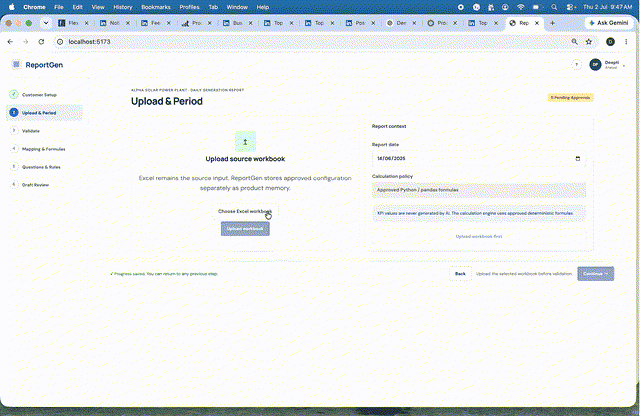
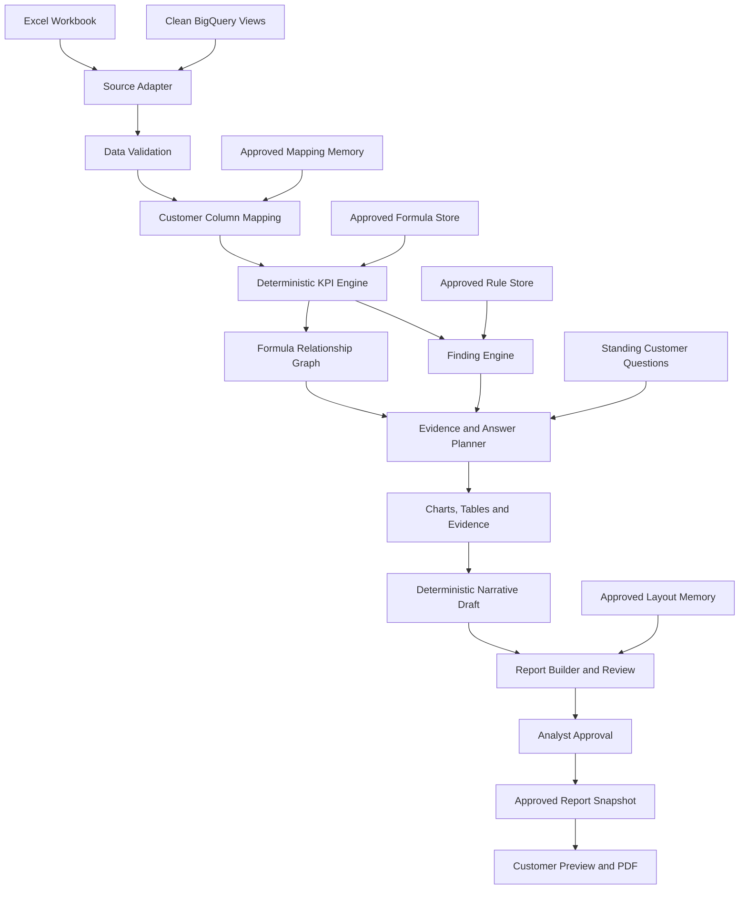
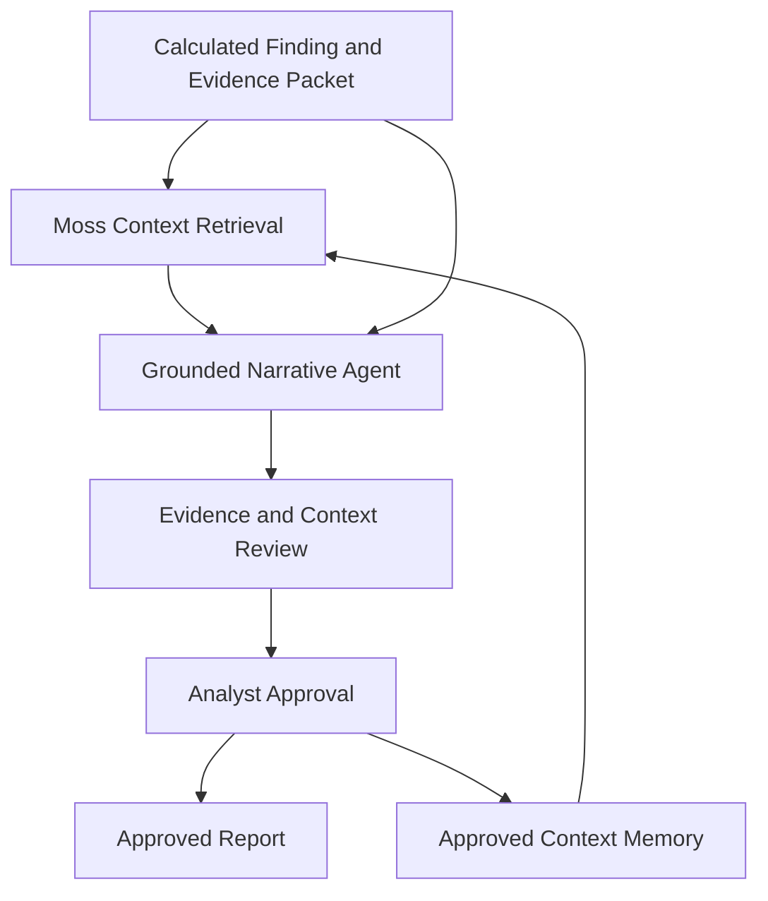

# VerityFlow

**Trusted evidence. Controlled intelligence.**

VerityFlow is an evidence-grounded reporting workflow that combines deterministic analytics, approved business context, controlled narrative generation, and analyst review.

The current MVP is demonstrated through recurring solar-performance reporting. It accepts report-ready Excel or BigQuery input, validates data quality, maps customer columns, calculates KPIs from approved formulas, applies approved rules, prepares chart-ready evidence, creates reviewable narratives, and produces a customer-facing report that can be approved and exported to PDF.

The product originated from recurring problems encountered while working with renewable-energy data: validating operational inputs, applying customer-specific definitions, answering the same reporting questions, and explaining the evidence behind each conclusion. Solar reporting is the first proving ground; the workflow is intended to extend to other evidence-sensitive reporting domains.

## Architecture

VerityFlow separates deterministic calculation, approved-context retrieval, controlled narrative generation, human review, and report publication so that every published conclusion remains traceable to evidence and an approval decision.

- **[View the architecture PDF](docs/architecture/verityflow-evidence-grounded-architecture.pdf)**
- **[Open the editable architecture in FigJam](https://www.figma.com/board/ph60CQzzIuhz1KUrWWY49R/VERITYFLOW?node-id=0-1&t=xVIQ6tMTy98dgxif-1)**

## Product Demo



- **[Watch or download the narrated VerityFlow demonstration](docs/demo/VerityFlow-hackathon-demo.mp4)**
- **[Download the earlier ReportGen prototype walkthrough](docs/demo/ReportGen-full-demo-condensed.mp4)**

The VerityFlow demonstration shows deterministic evidence generation, governed Moss context retrieval, visible provenance, analyst review, report building and customer-facing output.

## Product Requirements

**[Read the VerityFlow product requirements document](docs/prd/verityflow-prd.pdf)**

## Product Principle

```text
Approved configuration defines the reporting context.
Python validates data and calculates facts.
Rules identify reportable findings.
Narrative logic assembles evidence for review.
The analyst controls what is approved and published.
```

KPI values are calculated by deterministic Python/pandas logic. They are not generated by an LLM.

## Implemented Workflow

```text
Excel workbook or clean BigQuery views
        -> source adapter
        -> data-quality validation and analyst guidance
        -> customer column mapping
        -> deterministic KPI calculation
        -> formula relationship graph
        -> approved insight rules and findings
        -> standing-question answer plan
        -> chart, table and evidence generation
        -> deterministic narrative draft
        -> report builder and analyst review
        -> approved layout and immutable report snapshot
        -> customer preview and PDF export
```



BigQuery is an input source, not an output. Source-specific joins, cleaning and transformations should happen in BigQuery. VerityFlow reads clean, report-ready views and then applies the same validation, mapping, calculation and review workflow used for Excel.

## Moss-Powered Governed Context Layer

The minimum governed-retrieval vertical slice is implemented. VerityFlow now creates a compact evidence packet from deterministic findings, retrieves only analyst-approved business context for the matching customer, report type and KPI, and assembles a reviewable narrative with visible provenance and retrieval latency.

The structured KPI calculations will remain deterministic. Moss will retrieve the approved business knowledge surrounding a calculated finding, such as customer priorities, KPI definitions, interpretation rules, recurring questions, reporting guidance and previously approved explanation patterns.



The intended responsibility boundary is:

```text
Deterministic engine: what happened?
Moss retrieval: which approved context is relevant?
Narrative agent: how should the evidence and context be expressed?
Analyst: should this be published?
```

Raw operational data will not be placed in Moss for KPI calculation.

### Run the Moss integration

Install the backend requirements, copy `.env.example` to `.env`, and provide Moss credentials:

```bash
pip install -r backend/requirements.txt
cp .env.example .env
```

```text
MOSS_ENABLED=true
MOSS_PROJECT_ID=your_project_id
MOSS_PROJECT_KEY=your_project_key
MOSS_INDEX_NAME=verityflow-approved-context
```

`POST /moss/context/sync` uploads/upserts the approved context records and loads the index. The normal `POST /calculate` flow then runs Moss retrieval and returns its trace under `draft.grounding`.

When credentials are absent—or Moss is unavailable—the application uses a deterministic local development fallback and labels it clearly in the API and Draft Review UI. That fallback is useful for local testing, but it is never presented as Moss retrieval.

The Draft Review trust panel shows:

- the calculated finding and evidence packet;
- the approved context returned by retrieval;
- customer/report/KPI/approval filters;
- the reviewable grounded narrative;
- Moss retrieval latency; and
- an explicit analyst action to copy the proposed wording into the executive summary.

## Current MVP Capabilities

### Customer and reporting memory

- Select an existing customer or create a new customer and site.
- View and edit saved customer profiles, capacities, identity labels and logo placement.
- Store customer/report-specific mappings, formulas, questions, rules and layouts.
- Create, save, version and approve report layouts.
- Approve an immutable report snapshot only after required review items are resolved.

### Data input and validation

- Upload Excel workbooks through the API and guided frontend.
- Connect to a local BigQuery demo source.
- Connect to clean BigQuery views with Google credentials and a read-only service account.
- Materialize BigQuery views into the same internal workbook package used downstream by Excel.
- Validate required sheets, columns, types, dates, duplicates and numeric fields.
- Detect missing intervals and selected solar-operational data-quality anomalies.
- Show the analyst what is wrong, why it matters and what should be corrected upstream.
- Leave source-data repair and imputation outside the product scope.

### Deterministic analytics and governed knowledge

- Confirm and persist customer column mappings.
- Validate, suggest and approve KPI formulas.
- Calculate KPIs using approved Python/pandas logic.
- Derive a KPI dependency graph from active approved formula definitions.
- Apply analyst-approved deterministic insight rules.
- Store recurring customer questions and plan the evidence required to answer them.
- Prevent pending mappings, formulas, rules or questions from silently becoming trusted logic.

### Report builder and review

- Generate line, bar, bar-plus-line, dual-axis line, stacked-bar, waterfall, heatmap and table components when supported by the selected data shape.
- Provide meaningful compatibility guidance when a requested chart cannot be generated.
- Select metrics, dates, time grain, breakdown and per-metric aggregation.
- Add, remove, reorder and resize report components.
- Place explanations above, beside or below a chart.
- Choose report theme and executive-summary placement.
- Review, edit, approve or reject system-suggested explanations.
- Display supporting evidence even when no business rule is triggered.
- Preview a customer-facing report and export it to PDF through print-optimised styling.

## Trust Boundaries

- The LLM must never calculate KPI values.
- A reportable finding must be supported by calculated evidence or an approved rule.
- Causal language should be used only when an approved relationship supports it.
- Inadequate data quality is surfaced to the analyst rather than silently repaired.
- Approved layouts are locked; changes create a new layout version.
- Only an approved report snapshot is treated as final output.
- Moss-retrieved context will be filtered by customer, report type, KPI and approval status.

## Core Backend Modules

- `backend/source_adapters.py` — Excel-compatible BigQuery source adapter and clean-view contract.
- `backend/storage.py` — source-file registration and materialisation used by Excel and BigQuery.
- `backend/validator.py` — schema, quality and anomaly guidance.
- `backend/mapper.py` — customer columns mapped to standard metrics.
- `backend/calculator.py` — profile-driven deterministic KPI calculation.
- `backend/formula_utils.py` — safe formula validation and dependency extraction.
- `backend/formula_service.py` — suggested and analyst-defined formula approval.
- `backend/relationships.py` — deterministic KPI relationship graph derived from formulas.
- `backend/insights.py` — approved rule execution and findings.
- `backend/answer_planner.py` — evidence planning for findings and standing questions.
- `backend/charts.py` — compatible chart/table generation and evidence summaries.
- `backend/narrator.py` — deterministic, editable narrative blocks from existing evidence.
- `backend/report_draft.py` — stable report-draft assembly.
- `backend/database.py` — SQLite product memory, layouts, approvals and snapshots.
- `backend/main.py` — FastAPI application and API endpoints.

## API Surface

```text
POST /upload
POST /sources/bigquery/connect
POST /validate
POST /calculate
POST /report-components/generate

GET  /report-layouts/{config_id}
PUT  /report-layouts/{config_id}
POST /report-layouts/{layout_id}/approve
POST /report-snapshots/approve

GET  /customers
POST /customers
GET  /customers/{customer_id}/context
PUT  /customers/{customer_id}/profile

GET  /profile/{customer_id}/{report_type}
GET  /mappings/{customer_id}
POST /approve/mappings
POST /mappings/reset

GET  /formulas/{customer_id}/{report_type}
POST /formulas/validate
POST /approve/formula
POST /approve/question
POST /approve/insight-rule
```

## BigQuery Input Contract

The production connector expects clean, pre-joined BigQuery views. The default view names are:

```text
reportgen_daily_kpis
reportgen_daily_timeseries
reportgen_inverter_performance
reportgen_loss_events
reportgen_plant_metadata
reportgen_historical_performance
```

They can be overridden in the connection request. A production pilot also requires:

- `google-cloud-bigquery` and `db-dtypes`
- Google application credentials for a read-only service account
- permission to query the configured project and dataset
- source views whose columns can be mapped to VerityFlow's standard metrics

## Project Structure

```text
verityflow/
├── backend/              FastAPI, deterministic analytics and product memory
├── frontend/             React/Vite guided analyst workflow and report builder
├── data/                 Local demonstration workbooks
├── docs/                 Images and demonstration media
├── tests/                Backend unit and end-to-end tests
└── outputs/              Ignored local uploads, charts and report artifacts
```

## Local Setup

### Backend

```bash
python -m venv .venv
source .venv/bin/activate
pip install -r backend/requirements.txt
python backend/database.py
python backend/mapper.py
uvicorn backend.main:app --reload --host 127.0.0.1 --port 8001
```

API documentation is available at `http://127.0.0.1:8001/docs`.

### Frontend

```bash
cd frontend
npm install
npm run dev
```

Open `http://127.0.0.1:5174/`.

These ports are intentionally separate from the original ReportGen prototype (`5173`/`8000`) so both applications can run independently.

Set `VITE_API_URL` when the backend is hosted at a different address.

## Verification

Run the backend suite:

```bash
PYTHONDONTWRITEBYTECODE=1 pytest -p no:cacheprovider tests
```

Build the frontend:

```bash
cd frontend
npm run build
```

## Current Scope and Roadmap

Implemented now:

- Solar daily-performance reporting as the primary demonstration use case
- Excel and BigQuery inputs
- Deterministic validation, mapping, formulas, rules and findings
- Configurable report components and aggregation policies
- Analyst review, layout approval and final report snapshots
- Customer-ready preview and browser-generated PDF export
- Approved customer-context store with strict customer/report/KPI scope
- Moss index sync and in-process semantic retrieval adapter
- Evidence/context provenance, retrieval latency and reviewable grounded wording

Planned next:

- LLM narrative generation constrained by the retrieved context and evidence packet
- Retrieval-quality and narrative-groundedness evaluation
- Deployed demonstration environment
- Server-generated PDFs and scheduled email delivery
- Configurable report packs for finance and other reporting domains

## Positioning

VerityFlow is not an autonomous report writer. It is a governed analytical workflow that connects:

```text
trusted data
-> deterministic calculations
-> approved rules and context
-> evidence-backed explanation
-> analyst review
-> controlled publication
```
